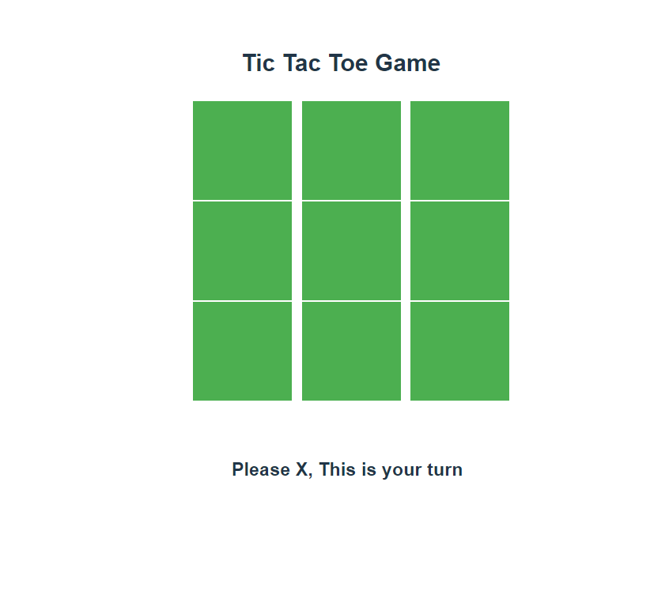
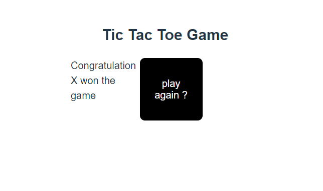

# React + Vite

## TIC TAC TOE 

I have made this project using react  hooks like use State
>> My approch toward this project is is make 3x3  box layout,for that i  first make a board component and squre component.give all the squere initially null after that give all the squre some number so that it will easy for me to track which squre im in.

>> After that I wrote in which criteria user will win the game 

>> after game finish it will show which player win the game.

>>Here is some snap from project.

>> Also add button after finish the game  and it will ask user "want to play again "
This template provides a minimal setup to get React working in Vite with HMR and some ESLint rules.

Currently, two official plugins are available:

- [@vitejs/plugin-react](https://github.com/vitejs/vite-plugin-react/blob/main/packages/plugin-react/README.md) uses [Babel](https://babeljs.io/) for Fast Refresh
- [@vitejs/plugin-react-swc](https://github.com/vitejs/vite-plugin-react-swc) uses [SWC](https://swc.rs/) for Fast Refresh
